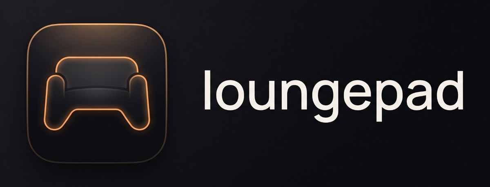

<h1 align="center">
  
</h1>

<p align="center">
  <b>Turn a Windows 11 PC into a console.</b><br>
  Your games, your desktop, your whole machine — driven from the couch with nothing in your hands
  but a controller.
</p>

<p align="center">
  <a href="https://github.com/sukumar-v/Loungepad/releases/latest">
    
  </a>
</p>

<p align="center">
  <a href="https://github.com/sukumar-v/Loungepad/releases/latest"></a>
  
  <a href="LICENSE"></a>
  
</p>


## Install

**[Download the latest release](https://github.com/sukumar-v/Loungepad/releases/latest)**, unzip it
anywhere, and run `Loungepad.exe`.

Nothing else to install: the .NET runtime is bundled. Windows 11 already has the one thing that is
not — the **Edge WebView2 Runtime** — and on Windows 10 the app will tell you where to get it.
Keep `Loungepad.exe` and the `ui` folder together; the UI is loaded off disk at startup.

The build is not code-signed yet, so Windows SmartScreen will warn the first time you run it:
choose **More info → Run anyway**.

On first run Loungepad scans Steam, Epic, GOG and the Xbox app for installed games, then puts
itself full-screen on your primary display. Point it at the TV in **Settings → Display**, and
turn on **Launch on startup** there if you want it to come up with Windows. Settings, library
and cover art live in `%APPDATA%\Loungepad`; uninstalling is deleting the folder you unzipped.

`Loungepad.exe --windowed` opens a 1280×720 window instead, which is easier to poke at from a desk.

While it runs, Loungepad has an icon in the notification area (the `^` by the clock, until you
pin it): click it to bring the launcher back, or right-click to check for updates or quit.

### Updates

Loungepad updates itself from this repository's releases. With **Settings → General → Update
automatically** on, which is the default, it checks every few hours, downloads a new version in
the background, and installs it the next time it starts. The **Loungepad** row above that toggle
checks on demand and installs straight away (it restarts the launcher, so not while a game is
running). Turn the toggle off and nothing is fetched until you ask.

An update replaces the files in the folder you unzipped into, so that folder has to be one your
account can write to — anywhere under your user folder is; `Program Files` is not.

### Coming from Consolify

Loungepad was called **Consolify** up to 1.4, which has no updater, so this one download is by
hand. Unzip it and run `Loungepad.exe`; you do not need to close Consolify first. On its first
start it closes a running Consolify, moves `%APPDATA%\Consolify` and `%LOCALAPPDATA%\Consolify`
to their Loungepad names, and switches the startup entry over. Your library, art, settings and
store sign-ins come with it. A shortcut that still starts `Consolify.exe` brings Loungepad to the
front, and once you are happy you can delete `Consolify.exe`.

## No keyboard. No mouse.

Most couch launchers get you as far as starting a game, then leave you stranded the moment you
need to do anything else — dismiss an update prompt, log into a store, close a window that opened
on the wrong screen. You end up walking to the desk for the mouse anyway.

Loungepad is built so that never happens. **The controller is a complete input device**, not just
a menu remote:

- **The left stick is the mouse.** Deadzone, sensitivity and an acceleration curve — slow near
  the centre for precision, fast at full deflection to cross a 4K screen — are all sliders in
  Settings. The right stick scrolls. A and B are left and right click, live across the whole
  desktop the moment the launcher isn't in front.
- **The keyboard comes to you.** Hold Start to raise the Windows touch keyboard, which takes
  gamepad input directly, so you can type a search, a password or a message without getting up.
  Text fields inside the launcher raise it on their own.
- **The Power Wheel runs Windows.** One double-tap of View + Menu, from anywhere — including
  mid-game — and you can switch to any open window (it gets dragged onto the TV with you), fire
  a saved shortcut, summon the keyboard, re-centre a lost pointer, close the window in front of
  you, or blank the TV and park the pad until you press a button again.
- **The pointer knows when to disappear.** Touch the D-pad and the cursor hides and stops
  stealing focus; nudge the stick or a real mouse and it comes straight back. Optionally
  system-wide, so it stays hidden out on the desktop too.
- **Any controller.** Xbox pads through XInput; a DualSense, a DualShock 4, a Switch Pro
  controller (over Bluetooth) or a generic pad through Raw Input, so they keep working while a
  game is in front. The button hints along the bottom, in every menu and in Settings are drawn as
  the buttons of the pad in your hand: the green A becomes a cross the moment you pick up a
  DualSense, and turns into a key cap when you touch the keyboard. A DualSense's touchpad works
  like a laptop's: the pointer, tap and press to click, tap-and-drag, two-finger scroll and
  right-click, and pinch to zoom.
- **A keyboard and mouse work too.** Arrows move, Enter selects, Esc goes back, X and Y are
  themselves, `/` searches and M opens Settings. The mouse hovers and clicks anywhere; a right
  click on a game opens its menu and a right click anywhere else goes back, a click on the dimmed
  screen closes a menu, and the hint bar is itself clickable.

The result is a machine you genuinely never have to walk over to. Games are the reason you sit
down; everything else stops being a reason to stand up.


## Your library, found automatically

Loungepad scans **Steam**, **Epic**, **GOG** and the **Xbox app** from their local install data —
no accounts, no API keys, nothing phoned anywhere. It picks up real cover art, tracks playtime and
sessions locally, and rescans every time it starts, so a game installed yesterday is simply there.
Anything the scanners drag in that isn't a game (benchmarks, wallpaper tools, redistributables)
gets hidden with one button.

Turn on **Show games you own but haven't installed** under Settings → Library and your whole Steam
library comes in too, the way Playnite's Steam integration does it. The account is read off the
Steam client's own login, so there is nothing to sign into; anything not on disk sits greyed out
in the grid, and pressing A on one hands it to Steam to install — the tile turns playable the
moment the download finishes. Steam's default privacy settings are enough. A profile that keeps
its game details private needs a free [Steam Web API key](https://steamcommunity.com/dev/apikey)
pasted into the row under the toggle, which is the one case where a key is ever asked for.

**Epic, GOG and Xbox** work the way they do in Playnite: sign in to each store once, from
Settings → Library, and its library is listed here. The sign-in is the store's own web page in a
window of its own — the stick is the mouse, the keyboard toggle raises the on-screen keyboard —
and Loungepad keeps only the resulting token, encrypted for your Windows account. Pressing A on a
game you own but do not have opens the right store ready to install: the Epic Games Launcher, GOG
Galaxy (or the game's gog.com page when Galaxy is not installed), or the Microsoft Store. The
Xbox list is your profile's title history, which is what Xbox Live exposes; **Show the PC Game
Pass catalogue** adds every game included with PC Game Pass, from Microsoft's public catalogue,
with no sign-in at all.

### The Xbox sign-in needs an app registration

Xbox Live only issues tokens to programs Microsoft knows about. Playnite works because its author
registered Playnite as an application with Microsoft — the "Let this app access your info?"
prompt you see there is the consent screen for that registration. The old trick of signing in as
one of Microsoft's own first-party clients is being withdrawn: the Xbox app's own id is now
refused outright (a 403 from the user-token service), and the one Loungepad falls back to can
stop working the same way at any time.

Registering one takes five minutes and costs nothing:

1. Sign in at https://portal.azure.com with any Microsoft account, open **Microsoft Entra ID →
   App registrations → New registration**.
2. Name it (say, "Loungepad"). Under **Supported account types** choose **Personal Microsoft
   accounts only**.
3. Under **Redirect URI** pick the platform **Public client/native (mobile & desktop)** and enter
   `https://login.live.com/oauth20_desktop.srf`. Register.
4. On the app's **Authentication** page set **Allow public client flows** to **Yes** and save. No
   client secret is needed, or wanted.
5. Copy the **Application (client) ID** from the Overview page.

Paste it into **Settings → Library → Xbox sign-in app id** and sign in again; the consent prompt
will now name your registration. If you build Loungepad yourself, put the same id into
`DefaultClientId` in `XboxAccountClient.cs` and everybody who runs your build gets the Xbox sign-in
with nothing to set up — which is exactly what Playnite ships.

The TV is treated as a first-class display: the launcher places itself there pixel-exactly, makes
it the Windows primary before a game starts so the game opens on the right screen, and puts your
old primary back when you quit.


## Emulators and ROMs

Loungepad runs emulated games the way Playnite and LaunchBox do: you tell it where the ROMs
are and what runs them, and the games take their place in the library like anything else —
cover art and box art, a description, a release date and a score, playtime, favourites,
collections, and a tile you press A on.

Most of it sets itself up. Every scan looks for emulators the way it looks for games: RetroArch
in a portable folder at a drive root or from Steam, anything installed under Program Files or
`%LOCALAPPDATA%`, a folder in Downloads or Desktop, an `Emulators` collection, the registry's
uninstall entries and the Start Menu's shortcuts. Games are found from **RetroArch's playlists**
first, which already say which system each ROM is and which core plays it, then from the game
folders PCSX2 and DuckStation keep in their settings, then from any folder named after a system
that holds a file of that system's kind: an EmuDeck-style `Emulation\roms\snes`, a `D:\ROMs\PS1`,
RetroArch's own `downloads\GBA`. Everything found gets a row under **Settings → Library →
Emulators & ROM folders**, marked *found automatically*, and anything you remove there stays
removed. **Find emulators and ROMs automatically** turns the whole thing off.

For anything the scan does not find, the same section adds it by hand, entirely from the gamepad:

1. **Add an emulator.** Point to its `.exe`. RetroArch, Dolphin, PCSX2, DuckStation, PPSSPP,
   Cemu, yuzu, Ryujinx, Citra/Azahar, melonDS, mGBA, Snes9x, bsnes, Mesen, Project64, ares,
   Flycast, Redream, MAME, xemu, Xenia, Mednafen, BlastEm, Kega Fusion, BizHawk and a few more
   are recognised from the file name and set up with the right command line. Anything else is
   started with the ROM's path and can be given arguments from its own row (`{rom}` is the file,
   `{romdir}`, `{romname}`, `{romfile}`, `{core}` and `{emudir}` also expand).
2. **Add a ROM folder.** Pick the folder, say which system it is for (the folder's name is the
   first guess — `SNES`, `psx`, `MegaDrive` all land on the right one) and which emulator runs
   it. One folder per system, which is how every ROM collection is organised anyway; the
   system decides which file extensions count as games, so save files, manuals and box scans
   beside the ROMs are left alone. A RetroArch folder also needs a core, and the first of that
   system's usual cores that is installed is chosen for you.

The folder is scanned on every start, like the stores are. Titles are read off the file names
with the No-Intro and GoodTools tags stripped — `Legend of Zelda, The - A Link to the Past (USA)
(Rev 1).sfc` becomes *The Legend of Zelda: A Link to the Past* — and that title is what the
metadata lookup runs on, so a game the file name does not describe (a MAME set called `sf2`)
can be renamed from its Manage menu and fetches again. Multi-disc games listed in an `.m3u`
are one game; `.bin` tracks named by a `.cue` are not listed twice.

Every system is a platform in the library's filter, under its own **Emulated** heading, so a
shelf of SNES games is one press away. An emulated game never merges with a store copy of the
same name: *Doom* on the SNES and DOOM on Steam are two games. Art and facts come from the same
shared service as every other non-Steam game, with the system passed along so the lookup asks
about the right *Doom*; Steam is never consulted for a ROM.

Playing one starts the emulator with the ROM, and the launcher treats the emulator as the game:
its window goes to the TV, the in-game menu closes it, and playtime is recorded against the ROM.
Per game, Manage offers **Rename**, **Run with** (a different emulator for this one game) and
its own launch arguments.

## Mods

Loungepad does not manage mods itself. It drives **[Vortex](https://www.nexusmods.com/site/mods/1)**,
Nexus Mods' free mod manager, which knows how to mod over 250 PC games — the Bethesda games,
Cyberpunk 2077, Baldur's Gate 3, The Witcher 3, Stardew Valley, Elden Ring, The Sims 4 and the
rest — and puts the parts of it you want from a sofa on the TV. Press **Y** on any installed game
and choose **Mods**:

- **Switch mods on and off.** Each row is one mod, with its version and author; A toggles it and
  Vortex deploys the change straight away.
- **Remove a mod.** X on the row. Vortex takes it out of the game and keeps the downloaded
  archive, so it can be put back from there.
- **Find mods.** *Find mods on Nexus Mods* opens the game's section of nexusmods.com in a window
  over the launcher; **Y** on a mod that came from Nexus opens that mod's own page. The window
  is driven the same way the store sign-ins are: the stick is the mouse, and its bar has
  **Back (B)**, **Forward (X)**, **Keyboard** (the same button as the keyboard toggle) and
  **Done (Y)**, each drawn with the button of the pad in hand. Choose **Mod manager download** on a mod and it goes straight to Vortex, which
  downloads and installs it in the background; it appears in the list when you come back.
- **Teach Vortex a game it does not know.** Vortex learns each game through an extension. For a
  game it has none for, the Mods screen lists the extensions in Vortex's catalogue that look
  like they are for it, exact match first: choosing one opens Vortex's own extension browser on
  it, on the TV, where Install is one click; or the extension's page on Nexus Mods, where **Mod
  manager download** installs it. After a restart of Vortex the game is known to it but not yet
  located, and **Set it up in Vortex** does the rest: Loungepad hands Vortex the game's folder
  (Vortex checks the game's files are in it) and Vortex opens on the game for its first-time
  questions, which are answered from the Mods screen like any other.
- **Answer Vortex's questions.** When Vortex stops to ask something — "this archive is not a
  layout I know, install it anyway?", "this file exists, replace it?" — the question appears at
  the top of the list with its own buttons, so it is answered from the sofa. A question that
  wants more than a button, such as a folder, still needs Vortex's window.
- **Open Vortex.** For load order, conflicts, mod options and anything else the list does not
  do, Vortex's own window is brought to the TV. Come back to the launcher the way you do after a
  game (the minimize combo, Guide by default).

The first time, two one-off steps happen in Vortex's own window: Vortex has to be restarted
once so it loads the small extension Loungepad installs into it (the screen says so and offers
to do it), and each game has to be *managed* in Vortex once — a folder for the mods, how they
are deployed. **Set it up in Vortex** on the Mods screen starts that and puts Vortex on the TV.
Opening the Mods screen starts Vortex minimized if it is not already running.

**If Vortex is not installed**, the Mods screen says so and explains how to get it: the
installer is on the Files tab of [nexusmods.com/site/mods/1](https://www.nexusmods.com/site/mods/1),
it installs for your own Windows account with no administrator step, and a free Nexus Mods
account (signed into inside Vortex) is only needed to download mods. **Open the download page**
opens it in your browser on the desktop. The same row lives under **Settings → Library → Mods**,
with an optional **Vortex location** for a portable copy or one on another drive.

How it works: Vortex has no way in from outside, so Loungepad ships a tiny Vortex extension
(`vortex-bridge`) that it copies into `%APPDATA%\Vortex\plugins\loungepad-bridge`. The extension
listens on the local machine only (`127.0.0.1`, a fresh secret per run) and turns a handful of
requests into calls on Vortex's own API — list, enable, disable, remove, deploy, switch game.
Downloads go through Vortex's own command line (`Vortex.exe --install <link>`). Vortex deploys
mods into the game folder itself, so the game launches exactly as it did before; nothing about
the launch changes. Mods for emulated games, and mod managers other than Vortex, are not
supported.

## Themes

A theme is a folder under `%APPDATA%\Loungepad\themes` — **Settings → Appearance → Themes
folder** opens it — with a `theme.css` in it and, optionally, a `theme.json` and a `theme.html`.
Nothing is compiled or copied: the launcher loads the files straight off disk, watches the folder
and reloads on save, so editing a theme is editing a file. Polish, the theme the launcher opens
on, ships this way too; Classic is the built-in look with no theme applied.

- **`theme.css`** is loaded after the app's own stylesheet, so it overrides by ordinary cascade
  order and needs no `!important`. Every colour in the UI resolves to a token on `:root` (`--bg`,
  `--bg-deep`, `--surface`, `--surface-hi`, `--card`, `--ink`, `--edge`, `--danger`, `--accent`),
  so a recolour is a handful of lines; anything else on the page is fair game.
- **`theme.html`** holds `<template data-template="…">` blocks that replace the built-in markup
  for a game tile, a carousel tile or a whole screen's layout (`screen-library`, with `data-slot`s
  the app moves its own regions into). A theme cannot run script: `<script>` and `on*` attributes
  are stripped. The header of `ui/theme.js` documents the binding.
- **`theme.json`** names the theme, and can set tokens and declare options:

  ```json
  {
    "name": "Polish", "author": "Loungepad", "version": "3.7",
    "description": "Full-bleed art, recents on a dock, the grid on the way down",
    "tokens": { "--bg": "#05070B" },
    "settings": [ ]
  }
  ```

  `version` matters for a bundled theme: the installed copy is refreshed when it changes.

### A theme's own options

`settings` in `theme.json` puts rows under **Settings → Appearance**, directly under the Theme
row, that belong to that theme alone. Their values are stored per theme and go nowhere but the
page, as CSS: each option becomes a `data-theme-<id>` attribute on `<html>` and, if it names a
`token`, a custom property on the root — so a theme keys its rules off either, with no script.
Polish declares five; two of them:

```json
"settings": [
  { "id": "columns", "name": "Tiles across", "type": "select",
    "options": ["5", "6", "7"], "default": "6", "token": "--tv-cols" },
  { "id": "labels", "name": "Always show titles", "type": "toggle", "default": false }
]
```

```css
.tv { --tile-w: calc((1760px - (var(--tv-cols, 6) - 1) * 28px) / var(--tv-cols, 6)); }
html[data-theme-labels="true"] .tv-name { opacity: 1; }
```

| field | |
|---|---|
| `id` | letters, digits and hyphens; the attribute is `data-theme-<id>` |
| `name`, `hint` | the row's label and the line under it |
| `type` | `toggle`, `select` or `slider` |
| `default` | `true`/`false`, one of the options, or a number |
| `options`, `labels` | a select's values, and what to show for each (optional) |
| `min`, `max`, `step`, `unit` | a slider's range, and the suffix its value carries into CSS (`px`) |
| `token` | the custom property the value is written to (`--…`) |
| `values` | what each value becomes in CSS when it is not the value itself: `{ "Slow": "700ms" }` |

Without `values`, a toggle writes `1` or `0`, a slider writes the number with its unit, and a
select writes the option. An entry that does not make sense is skipped rather than shown broken.

The accent colour, the button hints and the animation settings are kept in the same per-theme
store, under the ids `accent`, `hide-hints`, `animations` and `animation-speed` — which is why a
theme cannot declare an option with one of those ids. **Restore <theme>'s defaults**, the last row,
puts that one theme's look, animation and options back and leaves every other theme as it is.

### Animation

Everything that moves — screens changing, menus and dialogs opening and closing, the Power Wheel,
the highlight — is timed off tokens on `:root`, each a base time multiplied by `--motion`:

```css
--motion: 1;                                 /* Settings → Appearance: the speed slider divides it, "off" writes 0 */
--t-focus: calc(180ms * var(--motion));      /* the highlight moving */
--t-fade: calc(240ms * var(--motion));       /* colour and opacity: the backdrop, a toast */
--t-menu: calc(220ms * var(--motion));       /* a menu, dialog or the wheel opening */
--t-menu-out: calc(150ms * var(--motion));   /* ...and closing */
--t-screen: calc(300ms * var(--motion));     /* one screen giving way to another */
--t-screen-out: calc(220ms * var(--motion));
--t-slide: calc(260ms * var(--motion));      /* a list or carousel following the highlight */
--ease, --ease-in                            /* the curves, in and out */
```

A theme retunes one kind of motion by redefining its token — keep the `var(--motion)` in it, so
the user's speed and their "off" still apply — or replaces an animation outright: a screen or
overlay carries `.active` while it is up and `.closing` for the length of its exit, and the
keyframes are ordinary rules in `app.css` (`screenIn`, `cardIn`, `cardOut`, `spokeIn`, …).
Multiply the durations in a theme's own transitions by `var(--motion, 1)` and they follow the
setting too; Polish does, and exposes its dock's slide as one of its options.

## Build & run

Requirements: **.NET 8 SDK**, **WebView2 Runtime** (preinstalled on Windows 11).

```bash
dotnet build Loungepad.sln
```

Run `Loungepad\bin\Debug\net8.0-windows\Loungepad.exe`, or open `Loungepad.sln`
in Visual Studio 2022 and F5. Pass `--windowed` for a 1280×720 debug window (no always-on-top,
no focus guarding) instead of the full-screen TV mode.

The UI can also be previewed in a plain browser (it self-mocks sample data when not hosted in
WebView2): serve `Loungepad/ui/` with any static server and open `index.html`.

To build the zip that goes on a release:

```powershell
.\tools\package.ps1            # or -Version 1.1.0 to stamp the tag you are about to push
```

It publishes self-contained and single-file into `artifacts\`, checks that `ui\` came along,
and writes `dist\Loungepad-v<version>-win-x64.zip` with its SHA-256.

The updater looks for the zip by that name's ending (`-win-x64.zip`) on the latest release of
`sukumar-v/Loungepad`, and for a tag it can read as a version (`v1.5.0`). Attach the zip exactly
as the script names it. A build from `dotnet build` never updates itself; only the single-file
build this script makes does.

The icon is cut out of the logo: `.\tools\make-icon.ps1` writes `Loungepad\Loungepad.ico` and
`loungepad-icon.png` from `assets\raw\Loungepad_logo.jpg`.

## Architecture

A native WPF shell (.NET 8) hosting the UI as an HTML/CSS/JS app in WebView2, bridged by JSON
messages, with every system-level feature behind Win32 P/Invoke.

```
Loungepad/
  MainWindow.xaml(.cs)    Borderless, topmost, taskbar-less window; hosts WebView2 on the TV display
  UiBridge.cs             JSON message bridge: web UI <-> native services
  ui/                     The design-faithful UI (index.html, app.css, app.js), 1920x1080 stage
                          scaled to the display; served via WebView2 virtual host loungepad.ui
  Services/
    DisplayService.cs     Monitor enumeration + primary-display switching (ChangeDisplaySettingsEx)
    GameLaunchService.cs  Launch orchestration, process tracking, window repositioning, playtime
    LibraryScanner.cs     Steam (ACF/VDF + librarycache art), Epic (.item manifests),
                          GOG (registry), Xbox (MicrosoftGame.config + AppModel repository),
                          ROM folders (one system per folder, see Models/Emulation.cs)
    RomTitles.cs          A game's title out of a ROM's file name (No-Intro / GoodTools tags)
    EmulatorLaunch.cs     The emulator command line for a ROM: {rom}, {core} and friends
    EmulatorDetection.cs  Finds installed emulators (folders, registry, Start Menu, Steam) and
                          ROM sources (RetroArch playlists, PCSX2/DuckStation game lists,
                          folders named after a system)
    RetroArchPlaylists.cs Reads RetroArch's .lpl playlists: ROM path, database label, core
    GamepadService.cs     Gamepad polling: UI navigation events + gamepad-mouse (SendInput/SetCursorPos),
                          merging XInput with the HID reader; publishes which pad family is in use
    HidGamepadReader.cs   Raw Input + hid.dll: DualSense, Switch Pro and generic pads, in XInput's shape
    VirtualKeyboardService.cs  Touch keyboard (TabTip) via ITipInvocation COM
    CursorService.cs      Optional system-wide pointer hiding while the D-pad drives
    StartupService.cs     HKCU Run key registration
    UpdateService.cs      Checks GitHub releases, downloads, swaps the files in place, restarts
    ConsolifyMigration.cs Carries an install over from the app's old name
    Storage.cs            JSON persistence in %APPDATA%\Loungepad (settings, library, log, covers)
  TrayIcon.cs             The notification-area icon: show, update, quit
  Interop/NativeMethods.cs   All P/Invoke declarations
  Interop/HidNative.cs       Raw Input and hid.dll, for the HID gamepad reader
```

## Feature notes

- **Appearance** — Settings → Appearance: the theme, then its look (accent colour, button hints),
  its animations (on or off, and how quick) and the options the theme declares for itself. All of
  it is kept per theme, so each theme has its own, and a restore row puts one theme back. Settings
  itself is a box over the library, which stays visible and blurred round it. See
  [Themes](#themes).
- **TV display targeting** — pick the TV in Settings → Display. The launcher window is placed
  there with `SetWindowPos` (pixel-exact, per-monitor DPI aware). Before a game launches the TV
  is made the Windows *primary* display (most games open on the primary), and the previous
  primary is restored when the game exits. As a fallback, for ~30 s after launch any visible
  game window that opened on another monitor is moved onto the TV.
- **Process tracking** — Steam/Epic launches go through their store URI, so the real game
  process is found by matching process image paths against the game's install directory
  (`QueryFullProcessImageName`); direct exe launches are tracked directly. Playtime, session
  count and last-played are recorded locally on exit.
- **Process tracking follows launcher chains** — sessions stay alive as long as *any* process
  from the game's install directory runs, so pre-launchers (REDprelauncher → REDlauncher →
  Cyberpunk2077.exe) don't end the session early. Per-game **launch arguments**
  (e.g. `--launcher-skip` for Cyberpunk) and a **direct-exe override** that bypasses the store
  launcher are available under Detail → Manage.
- **Game options menu** — **Y** on any game opens a context menu: View game (the full detail
  page), favorite, add to collection, change cover art, and **Hide**. Hidden entries drop out of
  the library entirely and collect under the **Hidden** collection, which is how you get rid of
  non-games that the platform scanners pick up (benchmarks, wallpaper tools, redistributables).
- **Library organisation** — Favorites, automatic per-platform collections (Steam, Epic, GOG,
  Xbox, Manual), custom collections, and Hidden. The **X** overlay has two dropdowns: a
  categorised **multi-select Filter** (platform / status / favorites) and a single-select
  **Sort** (A–Z, Z–A, recently played, most played, largest, smallest); **Y** resets both.
  LB/RB switches between Library, Collections and Settings.
- **Adding games** — a **+ Add game** tile sits at the end of the library grid, and the same
  action lives under Settings → Library. File dialogs drop always-on-top while open, otherwise
  they open *behind* the full-screen launcher and appear to do nothing.
- **Pointer / D-pad input modes** — the mouse pointer hides and hover stops stealing focus as
  soon as the D-pad drives; moving the stick or a real mouse brings it straight back. Inside the
  launcher this is free; Settings → "Hide pointer system-wide" extends it to the rest of Windows
  by swapping the system cursors (restored on exit, on crash and on process exit).
- **Gamepad** (XInput pad 0, plus any HID pad):
  - Xbox and XInput-compatible pads are read through XInput. Everything else -- Sony's
    DualShock 4 and DualSense, Nintendo's Switch Pro controller, generic HID pads -- is read
    through Raw Input (`RIDEV_INPUTSINK`, so input arrives even with a game in front) and parsed
    with hid.dll from the pad's own descriptor. Sony pads are mapped by their well-known button
    order; the Switch Pro is mapped by *position* (its B is the bottom button, so it does what
    A does on an Xbox pad, and the legend draws a B next to "Select"); anything unrecognised
    gets the Sony order, which most generic pads follow. Two pads can be attached at once: the
    one that moved last is the one driving.
  - The **on-screen hints follow the pad in hand**: Xbox letters, PlayStation shapes, Switch
    letters, a four-button diamond for a generic pad, and key caps once a keyboard or mouse is
    used. Settings rows that name gamepad buttons always draw the last gamepad used.
  - **The touchpad on a DualSense (and DualShock 4) is a precision touchpad**, with a laptop's
    gestures:

    | Gesture | Does |
    |---|---|
    | One finger | Moves the pointer, faster for a flick and slower for a nudge |
    | Tap, or press the pad | Left click (a press is held for as long as it is held, so it drags) |
    | Tap twice | Double click |
    | Tap, then touch and hold | Holds the left button while the finger moves: drag a window, select text. Lift and touch again quickly to carry on; tap to let go |
    | Two-finger tap, or press with two fingers down | Right click |
    | Two-finger swipe | Scrolls, up and down or sideways, and coasts after a flick |
    | Pinch or spread | Zooms (Ctrl + wheel) |

    The pad reports two touch points, so three- and four-finger gestures are not possible. The
    pointer holds still around a press, so clicking does not nudge it. Sensitivity, tap-to-click,
    tap-and-drag, scroll direction and scroll speed are under Settings → Controller. The touch data sits in the vendor part of
    the pad's report, so Sony pads are read from their full report directly; on Bluetooth the
    launcher asks the pad for that report the way Steam does.
  - Known limits: a Switch Pro controller over USB sends nothing until it has been through
    Nintendo's handshake, so connect it over Bluetooth. Battery is shown for Bluetooth pads
    only, and for a pad on the cable it is whatever Windows last saw over Bluetooth.
  - Launcher focused → D-pad/A/B/X/Y drive the UI exactly as the on-screen legend shows;
    the left stick moves the mouse cursor (hover focuses, so stick and D-pad stay in sync),
    right stick scrolls.
  - Launcher not focused, no game running (e.g. you tabbed to the desktop) → the configured
    buttons (defaults: A = left click, B = right click) send real mouse clicks.
  - Game running → the whole service idles so games with native controller support never see
    phantom input (opt back in with Settings → "Stay active while a game runs").
  - **View + Menu (Back + Start) together** minimizes the launcher to use the desktop, and
    restores it when pressed again.
  - Deadzone, sensitivity and the acceleration exponent (slow near center, fast at full
    deflection) are sliders in Settings.
  - The header shows a controller **battery gauge** — only for wireless pads that actually
    report a battery; wired controllers show nothing.
- **Keyboard and mouse** — the page has keyboard focus whenever the launcher is the active
  window. Arrows navigate, Enter (or Space) is A, Esc (or Backspace) is B, X and Y are X and Y,
  `[` and `]` are the shoulders, `/` opens search and M opens Settings. With the mouse, hovering
  highlights and clicking selects; a right click on a game opens its options and a right click
  elsewhere is Back; clicking the dimmed screen around a menu closes it; the arrows on a settings
  row step its value; and every entry in a hint bar can be clicked to press that button.
- **Virtual keyboard** — the Windows *touch* keyboard (TabTip) via the ITipInvocation COM
  interface; osk.exe is only a last-resort fallback when TabTip doesn't exist. Hold Start
  (button + hold time configurable) to toggle; text inputs in the UI (collection names, launch
  arguments) raise it automatically. **The keyboard only accepts gamepad input on its "Gamepad"
  layout**, which Windows exposes solely through the keyboard's own settings flyout — there is
  no registry value or API to select it, so the app cannot switch it for you. It is a one-time
  choice that persists: step 01 of the in-app setup guide walks through it.
- **Lock screen, wake & startup** — Settings → "Launch Loungepad at login" (HKCU Run key),
  plus a step-by-step in-app guide: the touch keyboard's Gamepad layout, a Windows Hello PIN for
  couch-friendly sign-in (the sign-in screen's touch keyboard supports gamepad input), letting the
  controller receiver wake the PC from sleep, and auto-starting the launcher.
- **Focus guarding** — no taskbar button; if the desktop steals focus while no game runs, the
  launcher re-activates itself (Settings → "Keep launcher focused"). Alt-Tab still works.

Data lives in `%APPDATA%\Loungepad\` (`settings.json`, `library.json`, `covers\`,
`loungepad.log`). Delete `library.json` to force a clean rescan.

Up to 1.4 the app was **Consolify**; see [Coming from Consolify](#coming-from-consolify) for what
the first start of Loungepad carries over.

Before that it was called **Couch Launcher**. On first run it copies `settings.json`,
`library.json` and any missing cover art out of `%APPDATA%\CouchLauncher\`, and moves an existing
HKCU Run entry across. It copies rather than moves, and leaves the old folder alone — delete that
yourself once you are satisfied the library came over.

## Design → native mapping (flagged deviations)

The imported design is the source of truth for palette, type, spacing, focus motion, backdrop
behaviour and screen structure. Things that could not map 1:1 to local desktop reality:

1. **ACHIEVEMENTS stat** (detail screen) — achievements aren't available offline for
   Steam/Epic/GOG without authenticated web APIs. Replaced with **SESSIONS** (locally tracked).
2. **"Y Screenshots & saves"** legend on the detail screen — no portable local source for
   screenshots/cloud-save state. Replaced by the Manage menu (cover art, launch arguments,
   direct-exe override).
3. **Continue-row progress bars** — the design implies completion progress, which no platform
   exposes locally. The bar shows playtime relative to your most-played recent title.
4. **Game descriptions** ("A hand-drawn descent through…") — not available locally; the detail
   screen shows platform / launch route / install path instead.
5. **Genre filter and Metacritic sort** — no offline data source (store metadata needs
   authenticated web APIs), so the Filter overlay offers platform/favorites/installed filters
   and A–Z / Z–A / recency / playtime / size sorts instead.
6. **Not-installed titles** — the design dims games that are owned but not installed. Steam's
   library is imported through its Web API, and Epic, GOG and Xbox libraries through a sign-in to
   each store, when set up (see above). Without them, "not installed" only shows for entries whose
   files have been removed since scanning.
7. **Sample imagery** — the design's placeholder photos are replaced by real cover art
   (Steam caches both portrait covers and landscape banners; Xbox supplies square store logos;
   manual entries use user-picked images) with a procedural gradient-and-initials placeholder
   when art is unavailable (Epic/GOG have no local art cache).
9. **Touch keyboard "Gamepad" layout** — the keyboard ignores controller input on its default
   layout, but Windows offers no registry value or API to select the Gamepad layout; it is
   only selectable from the keyboard's own settings flyout. Documented as a one-time manual
   step (guide step 01) rather than automated with an undocumented registry write.
8. **Fonts** — Manrope / IBM Plex Mono load from Google Fonts when online; otherwise the UI
   falls back to Segoe UI / Consolas.

## Explicitly out of scope

No input injection at the Windows lock screen / Secure Desktop (OS restriction; handled outside
this app). The in-app wake guide recommends automatic sign-in for a couch-only setup.

## Contributing

Bug reports and small fixes are welcome; open an issue first for anything larger. Build steps,
the conventions this repo follows, and what is deliberately out of scope are in
[CONTRIBUTING.md](CONTRIBUTING.md).

## License

Licensed under the [Apache License 2.0](LICENSE). See [NOTICE](NOTICE) for attribution and
third-party components.

"Loungepad" and the Loungepad logo are **not** covered by that grant — section 6 of the license
reserves trademarks. Fork it freely; give the fork its own name.
