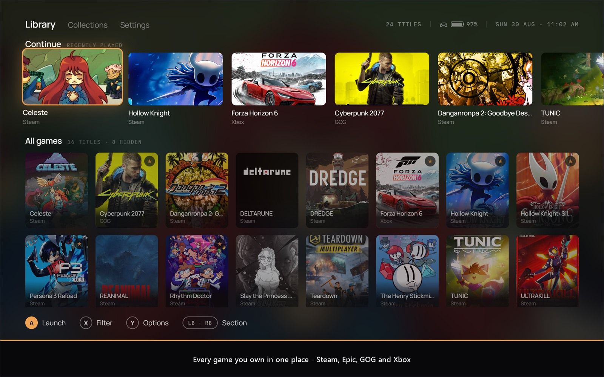
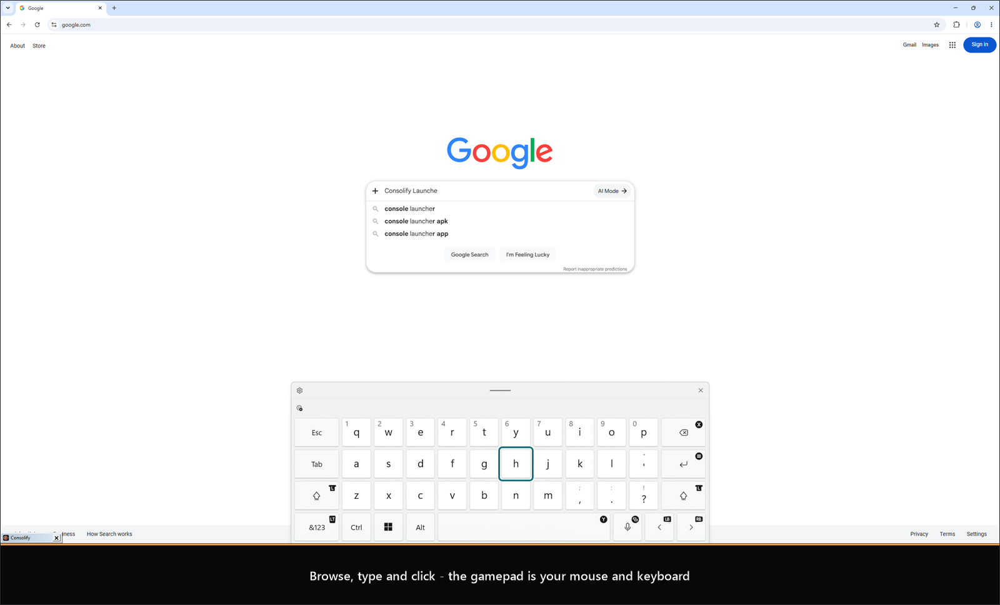
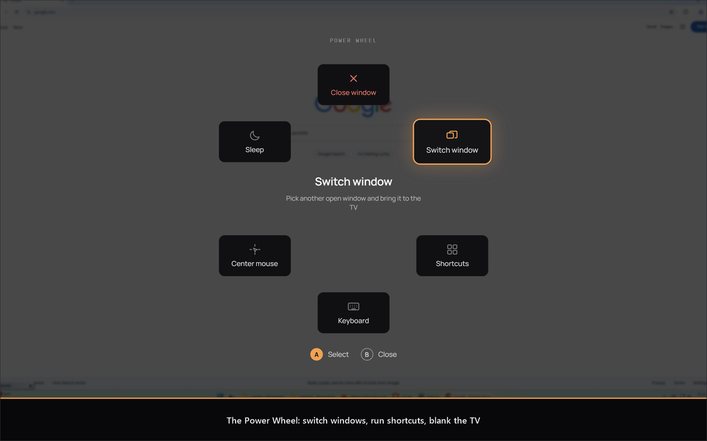
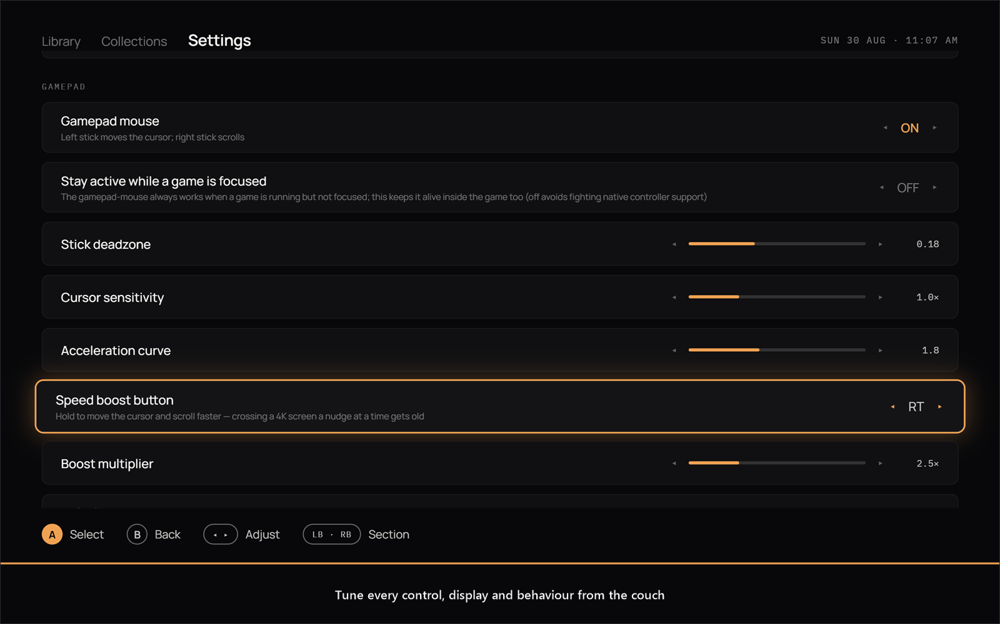

<p align="center">
  
</p>

<h1 align="center">Consolify</h1>

<p align="center">
  <b>Turn a Windows 11 PC into a console.</b><br>
  Your games, your desktop, your whole machine — driven from the couch with nothing in your hands
  but a controller.
</p>

<p align="center">
  <a href="https://github.com/sukumar-v/Consolify/releases/latest">
    
  </a>
</p>

<p align="center">
  <a href="https://github.com/sukumar-v/Consolify/releases/latest"></a>
  
  <a href="LICENSE"></a>
  
</p>



## Install

**[Download the latest release](https://github.com/sukumar-v/Consolify/releases/latest)**, unzip it
anywhere, and run `Consolify.exe`.

Nothing else to install: the .NET runtime is bundled. Windows 11 already has the one thing that is
not — the **Edge WebView2 Runtime** — and on Windows 10 the app will tell you where to get it.
Keep `Consolify.exe` and the `ui` folder together; the UI is loaded off disk at startup.

The build is not code-signed yet, so Windows SmartScreen will warn the first time you run it:
choose **More info → Run anyway**.

On first run Consolify scans Steam, Epic, GOG and the Xbox app for installed games, then puts
itself full-screen on your primary display. Point it at the TV in **Settings → Display**, and
turn on **Launch on startup** there if you want it to come up with Windows. Settings, library
and cover art live in `%APPDATA%\Consolify`; uninstalling is deleting the folder you unzipped.

`Consolify.exe --windowed` opens a 1280×720 window instead, which is easier to poke at from a desk.

## No keyboard. No mouse.

Most couch launchers get you as far as starting a game, then leave you stranded the moment you
need to do anything else — dismiss an update prompt, log into a store, close a window that opened
on the wrong screen. You end up walking to the desk for the mouse anyway.

Consolify is built so that never happens. **The controller is a complete input device**, not just
a menu remote:

- **The left stick is the mouse.** Deadzone, sensitivity and an acceleration curve — slow near
  the centre for precision, fast at full deflection to cross a 4K screen — are all sliders in
  Settings. The right stick scrolls. A and B are left and right click, live across the whole
  desktop the moment the launcher isn't in front.
- **The keyboard comes to you.** Hold Start to raise the Windows touch keyboard, which takes
  gamepad input directly, so you can type a search, a password or a message without getting up.
  Text fields inside the launcher raise it on their own.
- **The Power Wheel runs Windows.** One double-tap of View + Menu, from anywhere — including
  mid-game — and you can switch to any open window (it gets dragged onto the TV with you), fire
  a saved shortcut, summon the keyboard, re-centre a lost pointer, close the window in front of
  you, or blank the TV and park the pad until you press a button again.
- **The pointer knows when to disappear.** Touch the D-pad and the cursor hides and stops
  stealing focus; nudge the stick or a real mouse and it comes straight back. Optionally
  system-wide, so it stays hidden out on the desktop too.
- **Any controller.** Xbox pads through XInput; a DualSense, a DualShock 4, a Switch Pro
  controller (over Bluetooth) or a generic pad through Raw Input, so they keep working while a
  game is in front. The button hints along the bottom, in every menu and in Settings are drawn as
  the buttons of the pad in your hand: the green A becomes a cross the moment you pick up a
  DualSense, and turns into a key cap when you touch the keyboard. A DualSense's touchpad works
  like a laptop's: the pointer, tap and press to click, tap-and-drag, two-finger scroll and
  right-click, and pinch to zoom.
- **A keyboard and mouse work too.** Arrows move, Enter selects, Esc goes back, X and Y are
  themselves, `/` searches and M opens Settings. The mouse hovers and clicks anywhere; a right
  click on a game opens its menu and a right click anywhere else goes back, a click on the dimmed
  screen closes a menu, and the hint bar is itself clickable.

The result is a machine you genuinely never have to walk over to. Games are the reason you sit
down; everything else stops being a reason to stand up.





## Your library, found automatically

Consolify scans **Steam**, **Epic**, **GOG** and the **Xbox app** from their local install data —
no accounts, no API keys, nothing phoned anywhere. It picks up real cover art, tracks playtime and
sessions locally, and rescans every time it starts, so a game installed yesterday is simply there.
Anything the scanners drag in that isn't a game (benchmarks, wallpaper tools, redistributables)
gets hidden with one button.

Turn on **Show games you own but haven't installed** under Settings → Library and your whole Steam
library comes in too, the way Playnite's Steam integration does it. The account is read off the
Steam client's own login, so there is nothing to sign into; anything not on disk sits greyed out
in the grid, and pressing A on one hands it to Steam to install — the tile turns playable the
moment the download finishes. Steam's default privacy settings are enough. A profile that keeps
its game details private needs a free [Steam Web API key](https://steamcommunity.com/dev/apikey)
pasted into the row under the toggle, which is the one case where a key is ever asked for.

**Epic, GOG and Xbox** work the way they do in Playnite: sign in to each store once, from
Settings → Library, and its library is listed here. The sign-in is the store's own web page in a
window of its own — the stick is the mouse, the keyboard toggle raises the on-screen keyboard —
and Consolify keeps only the resulting token, encrypted for your Windows account. Pressing A on a
game you own but do not have opens the right store ready to install: the Epic Games Launcher, GOG
Galaxy (or the game's gog.com page when Galaxy is not installed), or the Microsoft Store. The
Xbox list is your profile's title history, which is what Xbox Live exposes; **Show the PC Game
Pass catalogue** adds every game included with PC Game Pass, from Microsoft's public catalogue,
with no sign-in at all.

### The Xbox sign-in needs an app registration

Xbox Live only issues tokens to programs Microsoft knows about. Playnite works because its author
registered Playnite as an application with Microsoft — the "Let this app access your info?"
prompt you see there is the consent screen for that registration. The old trick of signing in as
one of Microsoft's own first-party clients is being withdrawn: the Xbox app's own id is now
refused outright (a 403 from the user-token service), and the one Consolify falls back to can
stop working the same way at any time.

Registering one takes five minutes and costs nothing:

1. Sign in at https://portal.azure.com with any Microsoft account, open **Microsoft Entra ID →
   App registrations → New registration**.
2. Name it (say, "Consolify"). Under **Supported account types** choose **Personal Microsoft
   accounts only**.
3. Under **Redirect URI** pick the platform **Public client/native (mobile & desktop)** and enter
   `https://login.live.com/oauth20_desktop.srf`. Register.
4. On the app's **Authentication** page set **Allow public client flows** to **Yes** and save. No
   client secret is needed, or wanted.
5. Copy the **Application (client) ID** from the Overview page.

Paste it into **Settings → Library → Xbox sign-in app id** and sign in again; the consent prompt
will now name your registration. If you build Consolify yourself, put the same id into
`DefaultClientId` in `XboxAccountClient.cs` and everybody who runs your build gets the Xbox sign-in
with nothing to set up — which is exactly what Playnite ships.

The TV is treated as a first-class display: the launcher places itself there pixel-exactly, makes
it the Windows primary before a game starts so the game opens on the right screen, and puts your
old primary back when you quit.




## Build & run

Requirements: **.NET 8 SDK**, **WebView2 Runtime** (preinstalled on Windows 11).

```bash
dotnet build Consolify.sln
```

Run `Consolify\bin\Debug\net8.0-windows\Consolify.exe`, or open `Consolify.sln`
in Visual Studio 2022 and F5. Pass `--windowed` for a 1280×720 debug window (no always-on-top,
no focus guarding) instead of the full-screen TV mode.

The UI can also be previewed in a plain browser (it self-mocks sample data when not hosted in
WebView2): serve `Consolify/ui/` with any static server and open `index.html`.

To build the zip that goes on a release:

```powershell
.\tools\package.ps1            # or -Version 1.1.0 to stamp the tag you are about to push
```

It publishes self-contained and single-file into `artifacts\`, checks that `ui\` came along,
and writes `dist\Consolify-v<version>-win-x64.zip` with its SHA-256.

## Architecture

A native WPF shell (.NET 8) hosting the UI as an HTML/CSS/JS app in WebView2, bridged by JSON
messages, with every system-level feature behind Win32 P/Invoke.

```
Consolify/
  MainWindow.xaml(.cs)    Borderless, topmost, taskbar-less window; hosts WebView2 on the TV display
  UiBridge.cs             JSON message bridge: web UI <-> native services
  ui/                     The design-faithful UI (index.html, app.css, app.js), 1920x1080 stage
                          scaled to the display; served via WebView2 virtual host consolify.ui
  Services/
    DisplayService.cs     Monitor enumeration + primary-display switching (ChangeDisplaySettingsEx)
    GameLaunchService.cs  Launch orchestration, process tracking, window repositioning, playtime
    LibraryScanner.cs     Steam (ACF/VDF + librarycache art), Epic (.item manifests),
                          GOG (registry), Xbox (MicrosoftGame.config + AppModel repository)
    GamepadService.cs     Gamepad polling: UI navigation events + gamepad-mouse (SendInput/SetCursorPos),
                          merging XInput with the HID reader; publishes which pad family is in use
    HidGamepadReader.cs   Raw Input + hid.dll: DualSense, Switch Pro and generic pads, in XInput's shape
    VirtualKeyboardService.cs  Touch keyboard (TabTip) via ITipInvocation COM
    CursorService.cs      Optional system-wide pointer hiding while the D-pad drives
    StartupService.cs     HKCU Run key registration
    Storage.cs            JSON persistence in %APPDATA%\Consolify (settings, library, log, covers)
  Interop/NativeMethods.cs   All P/Invoke declarations
  Interop/HidNative.cs       Raw Input and hid.dll, for the HID gamepad reader
```

## Feature notes

- **TV display targeting** — pick the TV in Settings → Display. The launcher window is placed
  there with `SetWindowPos` (pixel-exact, per-monitor DPI aware). Before a game launches the TV
  is made the Windows *primary* display (most games open on the primary), and the previous
  primary is restored when the game exits. As a fallback, for ~30 s after launch any visible
  game window that opened on another monitor is moved onto the TV.
- **Process tracking** — Steam/Epic launches go through their store URI, so the real game
  process is found by matching process image paths against the game's install directory
  (`QueryFullProcessImageName`); direct exe launches are tracked directly. Playtime, session
  count and last-played are recorded locally on exit.
- **Process tracking follows launcher chains** — sessions stay alive as long as *any* process
  from the game's install directory runs, so pre-launchers (REDprelauncher → REDlauncher →
  Cyberpunk2077.exe) don't end the session early. Per-game **launch arguments**
  (e.g. `--launcher-skip` for Cyberpunk) and a **direct-exe override** that bypasses the store
  launcher are available under Detail → Manage.
- **Game options menu** — **Y** on any game opens a context menu: View game (the full detail
  page), favorite, add to collection, change cover art, and **Hide**. Hidden entries drop out of
  the library entirely and collect under the **Hidden** collection, which is how you get rid of
  non-games that the platform scanners pick up (benchmarks, wallpaper tools, redistributables).
- **Library organisation** — Favorites, automatic per-platform collections (Steam, Epic, GOG,
  Xbox, Manual), custom collections, and Hidden. The **X** overlay has two dropdowns: a
  categorised **multi-select Filter** (platform / status / favorites) and a single-select
  **Sort** (A–Z, Z–A, recently played, most played, largest, smallest); **Y** resets both.
  LB/RB switches between Library, Collections and Settings.
- **Adding games** — a **+ Add game** tile sits at the end of the library grid, and the same
  action lives under Settings → Library. File dialogs drop always-on-top while open, otherwise
  they open *behind* the full-screen launcher and appear to do nothing.
- **Pointer / D-pad input modes** — the mouse pointer hides and hover stops stealing focus as
  soon as the D-pad drives; moving the stick or a real mouse brings it straight back. Inside the
  launcher this is free; Settings → "Hide pointer system-wide" extends it to the rest of Windows
  by swapping the system cursors (restored on exit, on crash and on process exit).
- **Gamepad** (XInput pad 0, plus any HID pad):
  - Xbox and XInput-compatible pads are read through XInput. Everything else -- Sony's
    DualShock 4 and DualSense, Nintendo's Switch Pro controller, generic HID pads -- is read
    through Raw Input (`RIDEV_INPUTSINK`, so input arrives even with a game in front) and parsed
    with hid.dll from the pad's own descriptor. Sony pads are mapped by their well-known button
    order; the Switch Pro is mapped by *position* (its B is the bottom button, so it does what
    A does on an Xbox pad, and the legend draws a B next to "Select"); anything unrecognised
    gets the Sony order, which most generic pads follow. Two pads can be attached at once: the
    one that moved last is the one driving.
  - The **on-screen hints follow the pad in hand**: Xbox letters, PlayStation shapes, Switch
    letters, a four-button diamond for a generic pad, and key caps once a keyboard or mouse is
    used. Settings rows that name gamepad buttons always draw the last gamepad used.
  - **The touchpad on a DualSense (and DualShock 4) is a precision touchpad**, with a laptop's
    gestures:

    | Gesture | Does |
    |---|---|
    | One finger | Moves the pointer, faster for a flick and slower for a nudge |
    | Tap, or press the pad | Left click (a press is held for as long as it is held, so it drags) |
    | Tap twice | Double click |
    | Tap, then touch and hold | Holds the left button while the finger moves: drag a window, select text. Lift and touch again quickly to carry on; tap to let go |
    | Two-finger tap, or press with two fingers down | Right click |
    | Two-finger swipe | Scrolls, up and down or sideways, and coasts after a flick |
    | Pinch or spread | Zooms (Ctrl + wheel) |

    The pad reports two touch points, so three- and four-finger gestures are not possible. The
    pointer holds still around a press, so clicking does not nudge it. Sensitivity, tap-to-click,
    tap-and-drag, scroll direction and scroll speed are under Settings → Controller. The touch data sits in the vendor part of
    the pad's report, so Sony pads are read from their full report directly; on Bluetooth the
    launcher asks the pad for that report the way Steam does.
  - Known limits: a Switch Pro controller over USB sends nothing until it has been through
    Nintendo's handshake, so connect it over Bluetooth. Battery is shown for Bluetooth pads
    only, and for a pad on the cable it is whatever Windows last saw over Bluetooth.
  - Launcher focused → D-pad/A/B/X/Y drive the UI exactly as the on-screen legend shows;
    the left stick moves the mouse cursor (hover focuses, so stick and D-pad stay in sync),
    right stick scrolls.
  - Launcher not focused, no game running (e.g. you tabbed to the desktop) → the configured
    buttons (defaults: A = left click, B = right click) send real mouse clicks.
  - Game running → the whole service idles so games with native controller support never see
    phantom input (opt back in with Settings → "Stay active while a game runs").
  - **View + Menu (Back + Start) together** minimizes the launcher to use the desktop, and
    restores it when pressed again.
  - Deadzone, sensitivity and the acceleration exponent (slow near center, fast at full
    deflection) are sliders in Settings.
  - The header shows a controller **battery gauge** — only for wireless pads that actually
    report a battery; wired controllers show nothing.
- **Keyboard and mouse** — the page has keyboard focus whenever the launcher is the active
  window. Arrows navigate, Enter (or Space) is A, Esc (or Backspace) is B, X and Y are X and Y,
  `[` and `]` are the shoulders, `/` opens search and M opens Settings. With the mouse, hovering
  highlights and clicking selects; a right click on a game opens its options and a right click
  elsewhere is Back; clicking the dimmed screen around a menu closes it; the arrows on a settings
  row step its value; and every entry in a hint bar can be clicked to press that button.
- **Virtual keyboard** — the Windows *touch* keyboard (TabTip) via the ITipInvocation COM
  interface; osk.exe is only a last-resort fallback when TabTip doesn't exist. Hold Start
  (button + hold time configurable) to toggle; text inputs in the UI (collection names, launch
  arguments) raise it automatically. **The keyboard only accepts gamepad input on its "Gamepad"
  layout**, which Windows exposes solely through the keyboard's own settings flyout — there is
  no registry value or API to select it, so the app cannot switch it for you. It is a one-time
  choice that persists: step 01 of the in-app setup guide walks through it.
- **Lock screen, wake & startup** — Settings → "Launch Consolify at login" (HKCU Run key),
  plus a step-by-step in-app guide: the touch keyboard's Gamepad layout, a Windows Hello PIN for
  couch-friendly sign-in (the sign-in screen's touch keyboard supports gamepad input), letting the
  controller receiver wake the PC from sleep, and auto-starting the launcher.
- **Focus guarding** — no taskbar button; if the desktop steals focus while no game runs, the
  launcher re-activates itself (Settings → "Keep launcher focused"). Alt-Tab still works.

Data lives in `%APPDATA%\Consolify\` (`settings.json`, `library.json`, `covers\`,
`consolify.log`). Delete `library.json` to force a clean rescan.

The app was previously called **Couch Launcher**. On first run it copies `settings.json`,
`library.json` and any missing cover art out of `%APPDATA%\CouchLauncher\`, and moves an existing
HKCU Run entry across. It copies rather than moves, and leaves the old folder alone — delete that
yourself once you are satisfied the library came over.

## Design → native mapping (flagged deviations)

The imported design is the source of truth for palette, type, spacing, focus motion, backdrop
behaviour and screen structure. Things that could not map 1:1 to local desktop reality:

1. **ACHIEVEMENTS stat** (detail screen) — achievements aren't available offline for
   Steam/Epic/GOG without authenticated web APIs. Replaced with **SESSIONS** (locally tracked).
2. **"Y Screenshots & saves"** legend on the detail screen — no portable local source for
   screenshots/cloud-save state. Replaced by the Manage menu (cover art, launch arguments,
   direct-exe override).
3. **Continue-row progress bars** — the design implies completion progress, which no platform
   exposes locally. The bar shows playtime relative to your most-played recent title.
4. **Game descriptions** ("A hand-drawn descent through…") — not available locally; the detail
   screen shows platform / launch route / install path instead.
5. **Genre filter and Metacritic sort** — no offline data source (store metadata needs
   authenticated web APIs), so the Filter overlay offers platform/favorites/installed filters
   and A–Z / Z–A / recency / playtime / size sorts instead.
6. **Not-installed titles** — the design dims games that are owned but not installed. Steam's
   library is imported through its Web API, and Epic, GOG and Xbox libraries through a sign-in to
   each store, when set up (see above). Without them, "not installed" only shows for entries whose
   files have been removed since scanning.
7. **Sample imagery** — the design's placeholder photos are replaced by real cover art
   (Steam caches both portrait covers and landscape banners; Xbox supplies square store logos;
   manual entries use user-picked images) with a procedural gradient-and-initials placeholder
   when art is unavailable (Epic/GOG have no local art cache).
9. **Touch keyboard "Gamepad" layout** — the keyboard ignores controller input on its default
   layout, but Windows offers no registry value or API to select the Gamepad layout; it is
   only selectable from the keyboard's own settings flyout. Documented as a one-time manual
   step (guide step 01) rather than automated with an undocumented registry write.
8. **Fonts** — Manrope / IBM Plex Mono load from Google Fonts when online; otherwise the UI
   falls back to Segoe UI / Consolas.

## Explicitly out of scope

No input injection at the Windows lock screen / Secure Desktop (OS restriction; handled outside
this app). The in-app wake guide recommends automatic sign-in for a couch-only setup.

## Contributing

Bug reports and small fixes are welcome; open an issue first for anything larger. Build steps,
the conventions this repo follows, and what is deliberately out of scope are in
[CONTRIBUTING.md](CONTRIBUTING.md).

## License

Licensed under the [Apache License 2.0](LICENSE). See [NOTICE](NOTICE) for attribution and
third-party components.

"Consolify" and the Consolify logo are **not** covered by that grant — section 6 of the license
reserves trademarks. Fork it freely; give the fork its own name.
